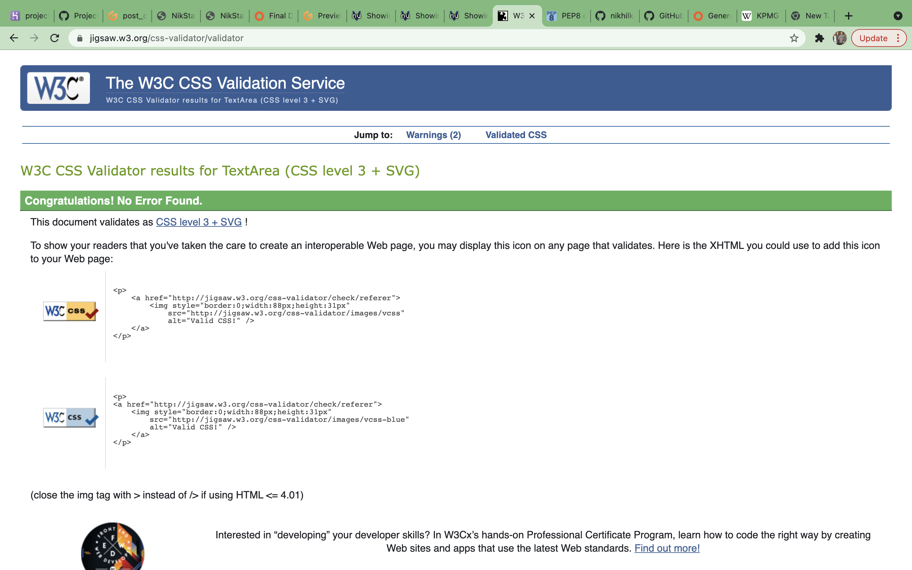

# Project 4 - Full Stack 

Welcome to my fourth project. This project is a blog website, using 2 different programs called Bootstrap and Django. I have also used 3 different languages: HTML5/CSS3, Javascript and Python. 

This project will show the use of CRUD functionality (Create, Read, Update, Delete). The user will be able create, read, update and delete their user profile/comments on the blog.

# 1 - UX

I am a big fan of the website "Reddit", I have always used the website to browse different topics, and of course getting involved. 

This project will showcase simplicity and ease to sign up to a blog, start a discussion, discuss with other users and get involved!

### Project Goals
The main goal of this project is to allow the user to sign up, sign in/out, create/update a user profile and create/update/delete a blog in a simple and effective process.

### User Goals:
First Time Visitor Goals
-   As a first-time visitor, I want to book a sign up to the website 
-   As a first-time visitor, I want to view the menu for all current blog discussions.

Returning Visitor Goals
-   As a Returning Visitor, I want to log back into the terminal.
-   As a Returning Visitor, I want to like and comment discussions
-   As a Returning Visitor, I want to edit any previous coomments or start topics.

Frequent User Goals
-   As a Frequent User, I want to check to see if there are more debates being added by various users and to get involved with the community.

### User Expectations:
The system should have a simple user interface, with the navigation to each section clear and concise.

-   The blog posts are clear to read.
-   The user interface is easy to navigate.
-   The website is responsive on all devices.
-   To have the ability to sign up via social media/online

### User Stories
Throughout the project I used the GitHub projects board to log all user stories as my project management tool. This helped me keep focus on the specific tasks as I would move them to the "in progress lane" as I'm working on the story. I would then move them to the "done" lane once the story has been completed. As you see below - you can see the story planned out with screenshots showing my progression.

# 2 Structure

It is really important to include responsive design in this project as many users are using different devices (mobile, tablet, laptop/PC). This gives the user the best experience on their device.

- Responsive on all device sizes
- Easy navigation through labelled buttons
- Footer at the bottom of the index page that links to the social media website.
- All elements will be consistent including font size, font family, colour scheme.

# 3 Skeleton 

Wireframes pic

# 4 Features

# 5 Technologies used

-   [HTML5](https://en.wikipedia.org/wiki/HTML)
    -   The project uses HyperText Markup Language.
-   [CSS3](https://en.wikipedia.org/wiki/CSS)
    -   The project uses Cascading Style Sheets.
-   [JavaScript](https://en.wikipedia.org/wiki/JavaScript)
    -   The project uses JavaScript.
-   [Python](https://en.wikipedia.org/wiki/Python_(programming_language))
    -   The project uses Python.
-   [Boostrap 5](https://getbootstrap.com/docs/5.0/getting-started/introduction/)
    -   The project uses Bootstrap 5.
-   [PostgreSQL](https://www.postgresql.org/)
    -   The project uses PostgreSQL as a database.
-   [Gitpod](https://www.gitpod.io/)
    -   The project uses Gitpod.
-   [Chrome](https://www.google.com/intl/en_uk/chrome/)
    -   The project uses Chrome to debug and test the source code using HTML5.
-   [Balsamiq](https://balsamiq.com/)
    -   Balsamiq was used to create the wireframes during the design process.
-   [GitHub](https://github.com/)
    -   GitHub was used to store the project's code after being pushed from Git.

### Google Developer Tools

### Responsive Tools

HTML VALIDATOR PICS
CSS PICS
JS
PYTHON

### Validator Tests

HTML
#### CSS3 - 
I used [W3C CSS Validation](https://jigsaw.w3.org/css-validator/) to check for any errors within my CSS stylesheet.

I had no errors in my css

 

PYTHON
JS

## Manual Testing
I have tested my site on Safari and google chrome on multiple devices.

These include:
-   iPhone X
-   iPhone XS Max
-   iPad Pro
-   MacBook Pro

Please find below my testing process for all pages via mobile and web:

# 6. Development Cycle

I used GitHub pages to deploy my final project. To do this I had to:
1. Login or Sign Up to [GitHub] - https://github.com/nikhilkalhan92/Project-4---Full-Stack
2. Create a new repository named "Project-4---Full-Stack"
3. Once created, click on "Settings" on the navigation bar under the repository title.
4. Choose which folder to deploy from, I used "/root".
5. Click "Save", then wait for it to be deployed. 
6. The URL will be displayed above the "source" section in GitHub Pages.

**HOW TO FORK A REPOSITORY**

If you need to make a copy of a repository:

1. Login or Sign Up to GitHub.
2. On GitHub, go to nikhilkalhan92/Project-4---Full-Stack.
3. In the top right corner, click "Fork".

For the final deployment to Heroku, I had to:
1. Uncomment the PostgreSQL databse from my settings.py file.
2. Set debug = False in my settings.py file.
3. Commit and push all files to GitHub
3. In Heroku, remove the DISABLE_COLLECTSTATIC config var.
4. In the deploy tab, go to the manual deploy sections and click deploy branch.

### Project Checklist
Install Django and the supporting libraries
1. Install Django and Gunicorn. Gunicorn is the server I am using to run Django on Heroku.
2. Install support libraries including psycopg2, this is used to connect the PostgreSQL database
3. Install Cloudinary libraries, this is a host provider service that stores images
4. Create the requirements.txt file. This includes the project's dependencies allowing us to run the project in Heroku.

Create a new, blank Django Project
1. Create a new project
2. Create the app
3. Add restaurant_booking to the installed apps in settings.py
4. Migrate all new changes to the database
5. Run the server to test

Setup project to use Cloudinary and PostgreSQL
1. Create new Heroku app
2. Sign into Heroku
3. Select New
4. Select create new app
5. Enter a relevant app name
6. Select appropriate region
7. Select the create app button

Attach PostgreSQL database
1. In Heroku go to resources
2. Search for Postgres in the add-ons box
3. Select Heroku Postgres
4. Submit order form

Prepare the environment and settings.py file
1. Create env.py file
2. Add DATABASE_URL with the Postgres URL from Heroku
3. Add SECRET_KEY with a randomly generated key
4. Add SECRET_KEY and generated key to the config vars in Heroku
5. Add if statement to settings.py to prevent the production server from erroring
6. Replace insecure key with the environment variable for the SECRET_KEY
7. Add Heroku database as the back end
8. Migrate changes to new database

Get static media files stored on Cloudinary
1. Create a Cloudinary account
2. From the dashboard, copy the API Environment variable
3. In the settings.py file create a new environment variable for CLOUDINARY_URL
4. Add the CLOUDINARY_URL variable to Heroku
5. Add a temporary config var for DISABLE_COLLECTSTATIC
6. In settings.py add Cloudinary as an installed app
7. Add static and media file variables
8. Add templates directory
9. Change DIR's key to point to TEMPALTES_DIR
10. Add Heroku hostname to allowed hosts
11. Create directories for media, static and templates in the project workspace
12. Create a Procfile

# 7 Final Product

# 8 Acknowledgments 

